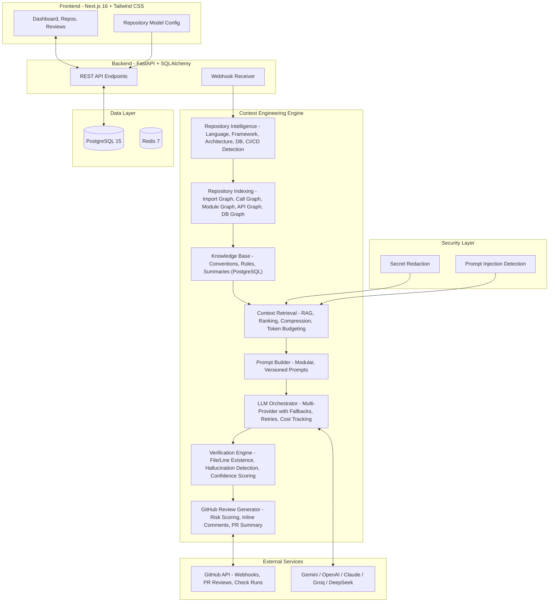
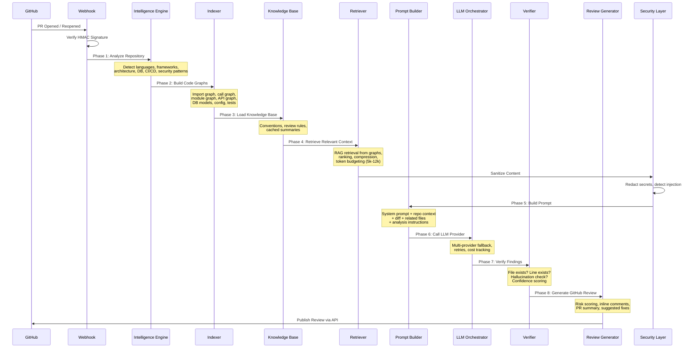

<div align="center">


# **Revora**

### The Open-Source Context Engineering Platform for AI Code Reviews

[](LICENSE)
[](https://python.org)
[](https://nextjs.org)
[](https://fastapi.tiangolo.com)
[](https://postgresql.org)
[](https://docker.com)
[](https://github.com/d-kavinraja/revora/stargazers)
[](https://github.com/d-kavinraja/revora/network/members)
[](https://github.com/d-kavinraja/revora/issues)

---

**Revora** is not another AI code review tool that reads diffs. It is a **Context Engineering Platform** that builds deep repository understanding before reasoning — analyzing architecture, dependencies, conventions, and developer intent to deliver enterprise-grade reviews.

</div>

---

## Why Revora?

<table>
<tr>
<td width="50%" valign="top">

### The Problem

Current AI code review tools:
- Read only the diff — no repository context
- Produce generic, low-confidence feedback
- Hallucinate file paths and code references
- Cannot understand architecture or conventions
- Act as black boxes with no explainability

</td>
<td width="50%" valign="top">

### The Revora Solution

Revora's Context Engineering Engine:
- Analyzes the **entire repository** structure
- Builds **code graphs** (imports, calls, modules, APIs)
- Retrieves **only relevant context** for each change
- **Verifies every finding** against actual code
- Supports **per-repository model configuration**

</td>
</tr>
</table>

---

## Architecture Overview



---

## Review Pipeline Flow



---

## Feature Status

<table>
<tr>
<td width="50%" valign="top">

### Completed

**Backend - Context Engineering Engine:**
- Repository Intelligence Engine (13 detectors)
- Repository Indexing (7 code graphs)
- Knowledge Base with PostgreSQL persistence
- Context Retrieval with RAG and token budgeting
- Modular Prompt Builder
- Multi-Provider LLM Orchestrator (Gemini, OpenAI, Claude, Groq, DeepSeek)
- Verification Engine (file/line checks, hallucination detection)
- GitHub Review Generator (inline comments, risk scoring)
- Security layer (secret redaction, prompt injection detection)
- SSE real-time event emitter
- Repository-level model configuration

**Backend - Core:**
- GitHub App authentication (JWT + installation tokens)
- GitHub OAuth login flow
- Webhook receiver with HMAC verification
- Review pipeline with 8-phase execution
- Celery worker configuration
- Alembic migrations (4 migrations, 17 tables)

**Frontend:**
- Landing page with hero and features
- GitHub OAuth login
- Dashboard with stats and recent reviews
- Repositories page with model configuration modal
- Reviews list with status filters
- Review detail with markdown rendering
- Settings page (API keys management)
- Light/dark mode toggle
- Responsive sidebar with collapse
- Shared components (StatusBadge, Skeleton, EmptyState)

</td>
<td width="50%" valign="top">

### In Development

**AI Capabilities:**
- Multi-provider LLM support (only Gemini available now)
- Auto-remediation (generating fix commits)
- Conversational PR interface (Chat with PR)
- PR description auto-generation

**GitHub Integration:**
- GitHub Checks API (pass/fail status checks)
- Inline code annotations on PR diffs

**Context Engineering:**
- Cross-repository context (microservices)
- Historical PR context understanding
- Tree-sitter based AST parsing (currently regex-based)

**Review Quality:**
- Developer feedback loop (upvote/downvote comments)
- Review accuracy improvement from feedback

**Enterprise:**
- Role-Based Access Control (RBAC)
- SSO/SAML integration
- Audit logging

**Frontend:**
- Real-time SSE execution dashboard on review detail page
- API keys settings page (route exists, needs full UI)

</td>
</tr>
</table>

---

## Supported LLM Providers

<table>
<tr>
<td align="center"><br/><sub>Available</sub></td>
<td align="center"><br/><sub>In Development</sub></td>
<td align="center"><br/><sub>In Development</sub></td>
<td align="center"><br/><sub>In Development</sub></td>
<td align="center"><br/><sub>In Development</sub></td>
</tr>
</table>

> Currently only **Google Gemini** is fully integrated. Multi-provider support is actively being developed.

---

## Context Engineering Modules

<table>
<tr>
<td align="center" width="25%">

**Repository Intelligence**
<br/><sub>13 detectors analyzing languages, frameworks, architecture pattern, database, package manager, testing, build tools, CI/CD, security auth, cloud provider, caching, queues, repo type — all without LLM</sub>

</td>
<td align="center" width="25%">

**Code Graph Indexing**
<br/><sub>7 graph types: import graph, call graph, module graph, API endpoint graph, database model graph, configuration graph, test graph — built via regex-based code parsing</sub>

</td>
<td align="center" width="25%">

**Context Retrieval**
<br/><sub>RAG-based retrieval from code graphs, hybrid ranking, context compression, token budgeting (5k-12k per review), deduplication</sub>

</td>
<td align="center" width="25%">

**Verification Engine**
<br/><sub>Every AI finding verified: file exists in repo, line number valid, not duplicate, not hallucinated, confidence-scored above threshold</sub>

</td>
</tr>
</table>

---

## Technology Stack

<table>
<tr>
<td><strong>Frontend</strong></td>
<td>


</td>
</tr>
<tr>
<td><strong>Backend</strong></td>
<td>


</td>
</tr>
<tr>
<td><strong>Infrastructure</strong></td>
<td>


</td>
</tr>
</table>

---

## Folder Structure

```
revora/
├── backend/
│   ├── app/
│   │   ├── ai/                    # LLM service, LangGraph agents, prompts, state
│   │   ├── api/v1/endpoints/      # FastAPI routes (auth, repos, reviews, dashboard, webhooks)
│   │   ├── core/                  # Auth (JWT, bcrypt), config, security (Fernet encryption)
│   │   ├── db/                    # SQLAlchemy async engine and session
│   │   ├── github/                # GitHub App auth, API client, webhook handler
│   │   ├── github_review/         # GitHub PR review format generator
│   │   ├── indexing/              # Code graph builders (import, call, module, API, DB, config, test)
│   │   ├── intelligence/          # Repository analysis (13 detectors, no LLM)
│   │   ├── knowledge/             # Knowledge base with DB persistence and caching
│   │   ├── models/                # SQLAlchemy ORM models (17 tables)
│   │   ├── orchestrator/          # Multi-provider LLM with fallbacks and cost tracking
│   │   ├── pipeline/              # 8-phase review pipeline orchestrator
│   │   ├── prompt_engine/         # Modular prompt builder with templates
│   │   ├── retrieval/             # RAG context retrieval with ranking and compression
│   │   ├── schemas/               # Pydantic request/response schemas
│   │   ├── security/              # Secret redaction, prompt injection detection
│   │   ├── services/              # Business logic (user, API key management)
│   │   ├── sse/                   # Server-Sent Events emitter
│   │   ├── verification/          # AI finding verification engine
│   │   └── worker/                # Celery background tasks
│   ├── alembic/                   # Database migrations (4 migrations)
│   └── requirements.txt
│
├── frontend/
│   └── src/
│       ├── app/                   # Next.js App Router (9 pages)
│       ├── components/            # React components
│       │   ├── layout/            # Sidebar, ThemeProvider
│       │   ├── shared/            # StatusBadge, Skeleton, EmptyState
│       │   └── ui/                # shadcn/ui primitives, Button, LoaderIcon, ThemeToggle
│       ├── lib/                   # Axios API client, utilities
│       └── store/                 # Zustand stores (auth, theme)
│
├── docker-compose.yml
└── README.md
```

---

## Quick Start

### Docker (Recommended)

```bash
git clone https://github.com/d-kavinraja/revora.git
cd revora
docker-compose up -d
```

### Manual Setup

<details>
<summary><strong>Backend Setup</strong></summary>

```bash
cd backend
python -m venv venv
source venv/bin/activate  # Windows: venv\Scripts\activate
pip install -r requirements.txt
copy .env.example .env
set PYTHONPATH=.
alembic upgrade head
uvicorn app.main:app --reload
```

</details>

<details>
<summary><strong>Frontend Setup</strong></summary>

```bash
cd frontend
npm install
npm run dev
```

</details>

---

## Contributing

We welcome contributions! Check the [Issues](https://github.com/d-kavinraja/revora/issues) tab for open tasks.

1. **Fork** the repository
2. **Create** a feature branch (`git checkout -b feature/amazing-feature`)
3. **Commit** your changes (`git commit -m 'Add amazing feature'`)
4. **Push** to the branch (`git push origin feature/amazing-feature`)
5. **Open** a Pull Request

---

## License

This project is licensed under the **MIT License** — see the [LICENSE](LICENSE) file for details.

---

<div align="center">

**Built with care by [Kavinraja.D](https://github.com/d-kavinraja)**


</div>
