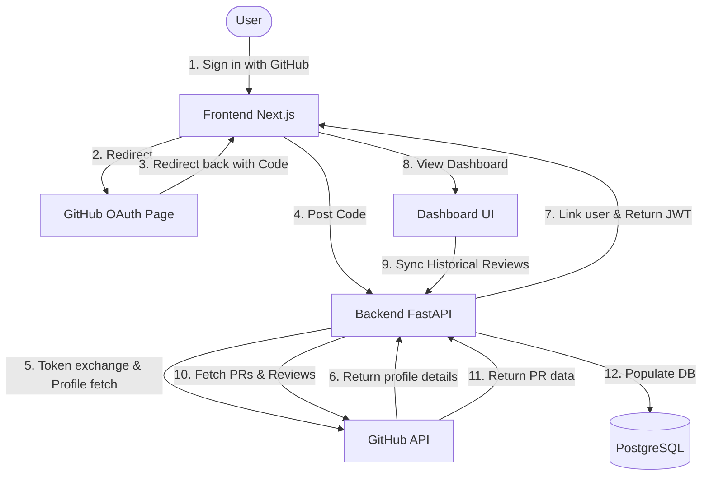
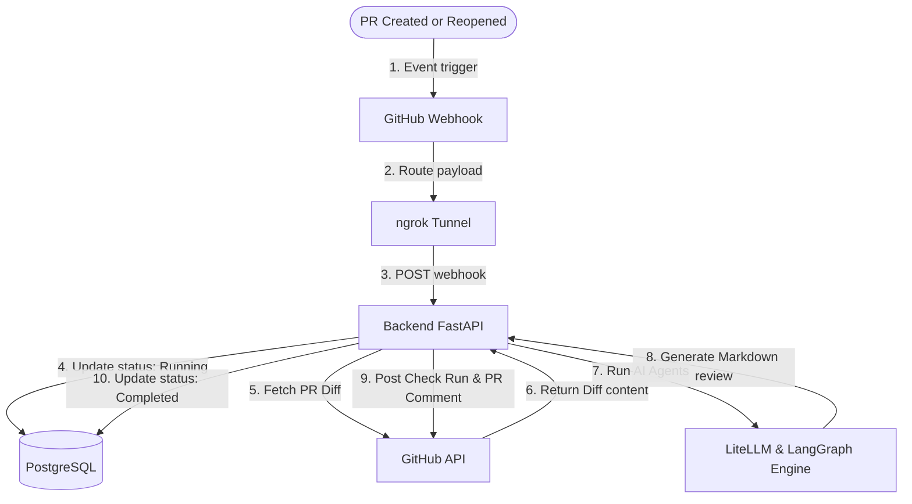

# Revora

An open-source AI-powered Software Engineering Platform that helps developers write, review, understand, maintain, and improve software using modern Large Language Models (LLMs).

Unlike traditional AI code review tools that only inspect pull request diffs, Revora builds a deep understanding of the entire repository before generating intelligent feedback through its Repository Context Engine (RCE).

---

## Architectural Flows

### User Authentication and Historical Synchronization Flow



### Real-Time Webhook PR Review Flow



---

## Features

| Feature | Description |
|---------|-------------|
| **AI Pull Request Reviews** | Intelligent code reviews with full repository context. |
| **Multi-Model Support** | Gemini, OpenAI, Claude, Grok, DeepSeek, OpenRouter, Ollama, Azure OpenAI. |
| **Repository Context Engine** | Deep analysis of structure, dependencies, patterns, and conventions. |
| **Multi-Agent AI** | Specialized AI agents for security, performance, style, and more. |
| **AI Patch Generation** | Automatic fix suggestions with one-click apply. |
| **Repository Chat** | Ask questions about any repository with full context awareness. |
| **Unit Test Generation** | Automatic test suggestions for changed code. |
| **Documentation Generation** | AI-powered documentation for functions, modules, and APIs. |
| **Engineering Analytics** | Review metrics, security trends, and team productivity insights. |
| **Rule Engine** | Custom review rules and coding standards enforcement. |
| **Organization Management** | Teams, roles, permissions, and audit logs. |
| **Self-Hosted** | Deploy on your own infrastructure with full control. |

---

## Product Modules

| Module | Description | Status |
|--------|-------------|--------|
| **Revora PR** | AI Pull Request Reviews | In Development |
| **Revora Chat** | Repository-aware AI Assistant | Planned |
| **Revora Test** | Automatic Unit Test Generation | Planned |
| **Revora Docs** | AI Documentation Generation | Planned |
| **Revora Fix** | Automatic Patch Generation | Planned |
| **Revora Insight** | Engineering Analytics Dashboard | Planned |
| **Revora CLI** | Command Line Interface | Planned |
| **Revora IDE** | VS Code and JetBrains Plugins | Planned |

---

## Tech Stack

| Layer | Technology |
|-------|-----------|
| **Frontend** | Next.js 15, Tailwind CSS, shadcn/ui, Zustand, TanStack Query |
| **Backend** | Python, FastAPI, SQLAlchemy, Alembic, Celery |
| **Database** | PostgreSQL |
| **Queue** | Redis + Celery |
| **AI** | LiteLLM, LangGraph |
| **Deployment** | Docker, Vercel, Render, GitHub Actions |

---

## Local Development Setup

### Prerequisites

- Python 3.10+
- Node.js 18+
- PostgreSQL 15+
- redis-server
- A GitHub App configured with your credentials
- A public ngrok tunnel for webhook routing

### Backend Configuration

1. Clone the repository and navigate to the backend directory:
   ```bash
   git clone https://github.com/d-kavinraja/revora.git
   cd revora/backend
   ```

2. Create and activate a Python virtual environment:
   ```bash
   python -m venv venv
   # On macOS/Linux:
   source venv/bin/activate
   # On Windows:
   venv\Scripts\activate
   ```

3. Install dependencies:
   ```bash
   pip install -r requirements.txt
   ```

4. Create a `.env` configuration file:
   ```bash
   copy .env.example .env
   ```

5. Run database migrations:
   ```bash
   set PYTHONPATH=.
   alembic upgrade head
   ```

6. Start the development server:
   ```bash
   uvicorn app.main:app --reload
   ```

### Frontend Configuration

1. Navigate to the frontend directory:
   ```bash
   cd ../frontend
   ```

2. Install dependencies:
   ```bash
   npm install
   ```

3. Create your `.env.local` configuration file:
   ```bash
   copy .env.example .env.local
   ```

4. Start the development server:
   ```bash
   npm run dev
   ```

---

## Competitive Landscape

| Product | Open Source | Multi Model | BYOK | Repo Context | GitHub App |
|---------|:----------:|:-----------:|:----:|:------------:|:----------:|
| **Revora** | Yes | Yes | Yes | Yes | Yes |
| CodeRabbit | No | Limited | No | Yes | Yes |
| GitHub Copilot | No | No | No | Partial | Yes |
| SonarQube | Partial | No | No | Static Only | No |
| DeepSource | No | Limited | No | Partial | Yes |

---

## Documentation

Full project documentation is available in the `revora-docs/docs/` directory:

- [Product Vision](revora-docs/docs/00-product-vision.md)
- [System Architecture](revora-docs/docs/01-system-architecture.md)
- [Functional Requirements](revora-docs/docs/03-functional-requirements.md)
- [Non-Functional Requirements](revora-docs/docs/04-non-functional-requirements.md)
- [Tech Stack](revora-docs/docs/05-tech-stack.md)
- [Backend Architecture](revora-docs/docs/06-backend-architecture.md)
- [Frontend Architecture](revora-docs/docs/07-frontend-architecture.md)
- [GitHub App](revora-docs/docs/08-github-app.md)
- [AI Engine](revora-docs/docs/09-ai-engine.md)
- [Database Design](revora-docs/docs/10-database.md)
- [API Specification](revora-docs/docs/11-api-specification.md)
- [UI/UX Specification](revora-docs/docs/12-ui-ux.md)
- [Security](revora-docs/docs/13-security.md)
- [Deployment](revora-docs/docs/14-deployment.md)
- [Testing](revora-docs/docs/15-testing.md)
- [Open Source Guide](revora-docs/docs/16-open-source-guide.md)
- [Roadmap](revora-docs/docs/18-roadmap.md)

---

## Contributing

We welcome contributions from the community. Please read our contributing guidelines before getting started.

### How to Contribute

1. Fork the repository
2. Create a feature branch (`git checkout -b feature/amazing-feature`)
3. Commit your changes (`git commit -m 'Add amazing feature'`)
4. Push to the branch (`git push origin feature/amazing-feature`)
5. Open a Pull Request

---

## License

This project is licensed under the MIT License. See the LICENSE file for details.