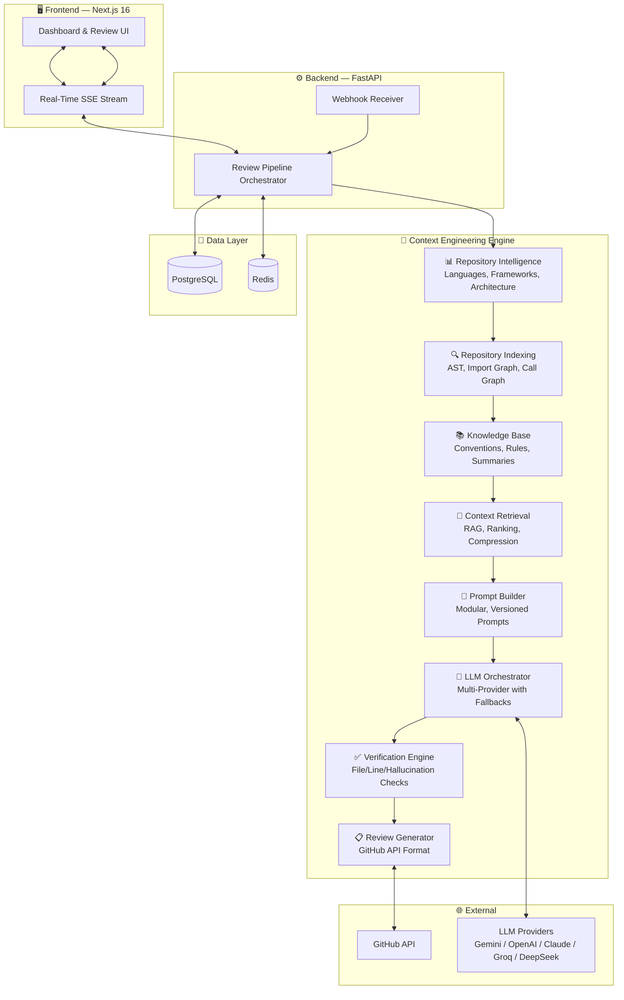
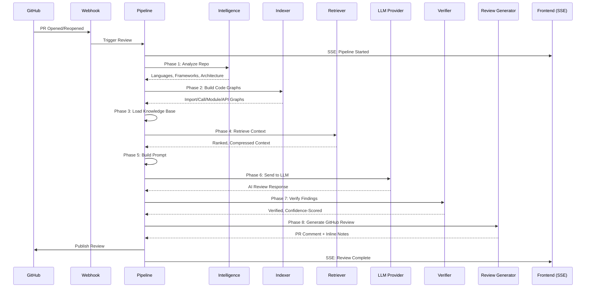

<div align="center">


# **Revora**

### The Open-Source Context Engineering Platform for AI Code Reviews

[](LICENSE)
[](https://python.org)
[](https://nextjs.org)
[](https://fastapi.tiangolo.com)
[](https://postgresql.org)
[](https://docker.com)
[](https://github.com/d-kavinraja/revora/stargazers)
[](https://github.com/d-kavinraja/revora/network/members)
[](https://github.com/d-kavinraja/revora/issues)

---

**Revora** is not another AI code review tool that reads diffs. It is a **Context Engineering Platform** that builds deep repository understanding before reasoning — understanding architecture, dependencies, conventions, and developer intent to deliver enterprise-grade reviews.

</div>

---

## Why Revora?

<table>
<tr>
<td width="50%" valign="top">

### The Problem

Current AI code review tools:
- Read only the diff — no repository context
- Produce generic, low-confidence feedback
- Hallucinate file paths and code references
- Cannot understand architecture or conventions
- Act as black boxes with no explainability

</td>
<td width="50%" valign="top">

### The Revora Solution

Revora's Context Engineering Engine:
- Analyzes the **entire repository** structure
- Builds **code graphs** (imports, calls, modules)
- Retrieves **only relevant context** for each change
- **Verifies every finding** against actual code
- Streams the full pipeline in **real-time**

</td>
</tr>
</table>

---

## Architecture Overview



---

## Review Pipeline Flow



---

## Features

<table>
<tr>
<td align="center" width="33%">

<br/>

**Repository Intelligence**
<br/><sub>Languages, frameworks, architecture, database, CI/CD, security patterns — all detected without LLM</sub>

</td>
<td align="center" width="33%">

<br/>

**Code Graph Indexing**
<br/><sub>Import graphs, call graphs, module graphs, API graphs, DB models, test coverage maps</sub>

</td>
<td align="center" width="33%">

<br/>

**Smart Context Retrieval**
<br/><sub>Only relevant files retrieved. Token-budgeted, compressed, deduplicated context</sub>

</td>
</tr>
<tr>
<td align="center" width="33%">

<br/>

**Multi-Provider LLM**
<br/><sub>Gemini, OpenAI, Claude, Groq, DeepSeek, Ollama — with fallbacks, retries, cost tracking</sub>

</td>
<td align="center" width="33%">

<br/>

**Verification Engine**
<br/><sub>Every finding verified: file exists, line exists, not hallucinated, confidence-scored</sub>

</td>
<td align="center" width="33%">

<br/>

**Real-Time Pipeline**
<br/><sub>Watch every stage execute live — no black boxes, full transparency and explainability</sub>

</td>
</tr>
<tr>
<td align="center" width="33%">

<br/>

**Security & Sanitization**
<br/><sub>Secret redaction, prompt injection detection, sandboxed repo cloning</sub>

</td>
<td align="center" width="33%">

<br/>

**Bring Your Own Key**
<br/><sub>Users provide their own API keys. Full cost transparency with token dashboards</sub>

</td>
<td align="center" width="33%">

<br/>

**Enterprise Ready**
<br/><sub>Clean Architecture, SOLID principles, async workers, Docker deployment</sub>

</td>
</tr>
</table>

---

## Supported LLM Providers

<table>
<tr>
<td align="center"><br/><sub>Default</sub></td>
<td align="center"><br/><sub>GPT-4o</sub></td>
<td align="center"><br/><sub>Claude Sonnet</sub></td>
<td align="center"><br/><sub>Llama 3.3</sub></td>
<td align="center"><br/><sub>DeepSeek Chat</sub></td>
</tr>
</table>

All providers are accessed through **LiteLLM** with automatic fallbacks, retries, and rate limiting.

---

## Technology Stack

<table>
<tr>
<td><strong>Frontend</strong></td>
<td>


</td>
</tr>
<tr>
<td><strong>Backend</strong></td>
<td>


</td>
</tr>
<tr>
<td><strong>Infrastructure</strong></td>
<td>


</td>
</tr>
</table>

---

## Context Engineering Flow

```
┌─────────────────────────────────────────────────────────────────────┐
│                    REVORA CONTEXT ENGINEERING FLOW                  │
├─────────────────────────────────────────────────────────────────────┤
│                                                                     │
│  ┌──────────┐    ┌──────────┐    ┌──────────┐    ┌──────────┐     │
│  │  📊 Repo  │───▶│ 🔍 Index │───▶│ 📚 Know  │───▶│ 🎯 RAG   │     │
│  │ Intelligence│  │  Graphs  │    │  Base    │    │ Retrieve │     │
│  └──────────┘    └──────────┘    └──────────┘    └──────────┘     │
│       │                │               │               │            │
│       ▼                ▼               ▼               ▼            │
│  Languages       Import Graph    Conventions     Ranked Files      │
│  Frameworks      Call Graph      Rules           Compressed        │
│  Architecture    Module Graph    Summaries       Token-Budgeted    │
│  Database        API Graph       ADRs            Deduplicated      │
│  CI/CD           DB Graph        Learnings                        │
│                                                                     │
│  ┌──────────┐    ┌──────────┐    ┌──────────┐    ┌──────────┐     │
│  │ 📝 Prompt │───▶│ 🤖 LLM   │───▶│ ✅ Verify│───▶│ 📋 GitHub│     │
│  │  Builder  │    │Orchestr.│    │  Engine  │    │  Review  │     │
│  └──────────┘    └──────────┘    └──────────┘    └──────────┘     │
│       │                │               │               │            │
│       ▼                ▼               ▼               ▼            │
│  System Prompt    Multi-Provider  File Exists     PR Comments      │
│  Repo Context     Fallbacks       Line Exists     Risk Score       │
│  Diff Content     Retries         Not Duplicate   Suggestions      │
│  Related Files    Cost Tracking   Confidence      Summary          │
│                                                                     │
└─────────────────────────────────────────────────────────────────────┘
```

---

## Folder Structure

```
revora/
├── backend/
│   ├── app/
│   │   ├── ai/                  # Core AI pipeline (LLM, graph, prompts)
│   │   ├── api/v1/endpoints/    # FastAPI route handlers
│   │   ├── core/                # Auth, config, security, dependencies
│   │   ├── db/                  # SQLAlchemy engine & session
│   │   ├── github/              # GitHub App auth, client, webhooks
│   │   ├── intelligence/        # 🧠 Repository Intelligence Engine
│   │   ├── indexing/            # 🔍 Code Graph Indexing
│   │   ├── knowledge/           # 📚 Knowledge Base
│   │   ├── models/              # SQLAlchemy ORM models
│   │   ├── orchestrator/        # 🤖 LLM Orchestrator
│   │   ├── pipeline/            # 🔗 Review Pipeline Orchestrator
│   │   ├── prompt_engine/       # 📝 Prompt Builder
│   │   ├── retrieval/           # 🎯 Context Retrieval Engine
│   │   ├── security/            # 🔒 Sanitization & injection detection
│   │   ├── schemas/             # Pydantic request/response schemas
│   │   ├── services/            # Business logic services
│   │   ├── sse/                 # 📡 Server-Sent Events
│   │   ├── verification/        # ✅ Finding Verification Engine
│   │   ├── github_review/       # 📋 GitHub Review Generator
│   │   └── worker/              # Celery background tasks
│   ├── alembic/                 # Database migrations
│   └── requirements.txt
│
├── frontend/
│   └── src/
│       ├── app/                 # Next.js App Router pages
│       ├── components/          # React components
│       │   ├── layout/          # Sidebar, ThemeProvider
│       │   ├── shared/          # StatusBadge, Skeleton, EmptyState
│       │   └── ui/              # shadcn/ui primitives
│       ├── lib/                 # API client, utilities
│       └── store/               # Zustand state stores
│
├── docker-compose.yml           # Full stack deployment
└── README.md
```

---

## Real-Time Execution Dashboard

Revora does not show a loading spinner. Users watch every pipeline stage execute live:

<table>
<tr>
<td align="center">

**Pipeline Timeline**
<br/><sub>30+ stages with status indicators</sub>

</td>
<td align="center">

**Live Log Stream**
<br/><sub>Real-time SSE event streaming</sub>

</td>
<td align="center>

**Token Dashboard**
<br/><sub>Input/output tokens, cost, latency</sub>

</td>
</tr>
</table>

Each stage exposes:
- ⏳ **Status** — Waiting / Running / Completed / Failed / Skipped
- ⏱️ **Duration** — Execution time per stage
- 📊 **Metrics** — Files scanned, tokens used, context size
- 📝 **Logs** — Detailed execution logs

---

## Quick Start

### Docker (Recommended)

```bash
git clone https://github.com/d-kavinraja/revora.git
cd revora
docker-compose up -d
```

### Manual Setup

<details>
<summary><strong>Backend Setup</strong></summary>

```bash
cd backend
python -m venv venv
source venv/bin/activate  # Windows: venv\Scripts\activate
pip install -r requirements.txt
copy .env.example .env
set PYTHONPATH=.
alembic upgrade head
uvicorn app.main:app --reload
```

</details>

<details>
<summary><strong>Frontend Setup</strong></summary>

```bash
cd frontend
npm install
npm run dev
```

</details>

---

## Contributing

We welcome contributions! Please see our contributing guidelines.

1. **Fork** the repository
2. **Create** a feature branch (`git checkout -b feature/amazing-feature`)
3. **Commit** your changes (`git commit -m 'Add amazing feature'`)
4. **Push** to the branch (`git push origin feature/amazing-feature`)
5. **Open** a Pull Request

---

## License

This project is licensed under the **MIT License** — see the [LICENSE](LICENSE) file for details.

---

<div align="center">

**Built with ❤️ by [Kavinraja.D](https://github.com/d-kavinraja)**


</div>
