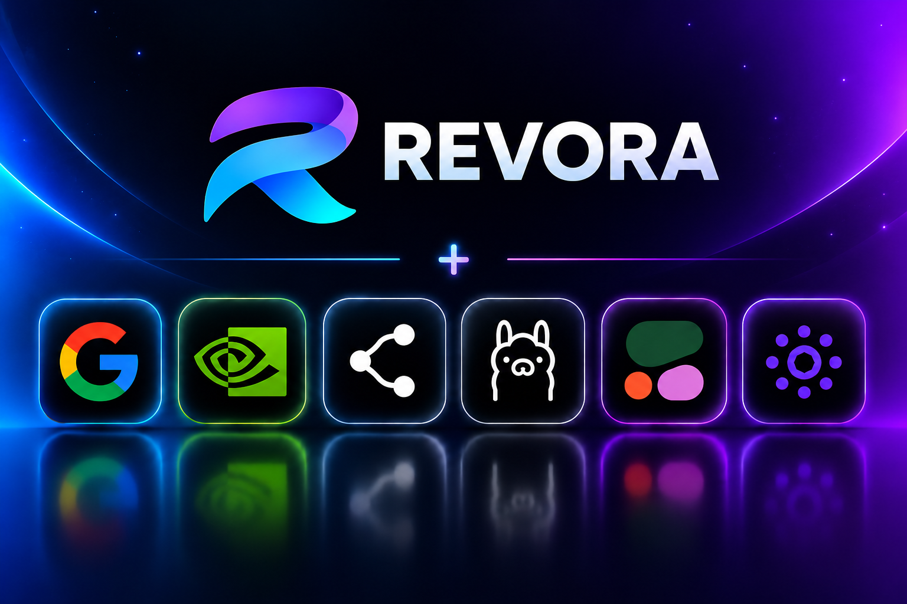
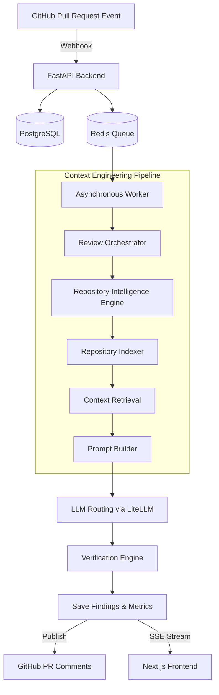

<div align="center">


# **Revora**

### The Open-Source AI Code Review Platform

[](LICENSE)
[](https://python.org)
[](https://nextjs.org)
[](https://fastapi.tiangolo.com)
[](https://postgresql.org)
[](https://docker.com)
[](https://github.com/d-kavinraja/revora/stargazers)

<p align="center">
  
</p>

---

**Revora** is an **Open-Source AI Code Review Platform** built to deliver intelligent, repository-aware code reviews. Instead of reviewing only pull request diffs, Revora understands the repository by analyzing its architecture, dependencies, code relationships, conventions, and developer intent before generating AI-powered feedback.

</div>

---

## Why Revora?

Traditional AI code review tools analyze a pull request diff in isolation. Without knowing the architecture of the surrounding codebase, they frequently produce generic feedback, hallucinate module paths, or suggest patterns that break existing project conventions. 

Revora solves this using a **Repository-Aware Context Engineering Engine**. 
By deeply integrating with GitHub via webhooks and OAuth, Revora automatically clones, indexes, and analyzes the entire repository upon every PR event. It dynamically retrieves relevant files, existing knowledge, and code graphs to build a comprehensive prompt for the AI. A Verification Engine then validates findings to dramatically reduce hallucination.

## Key Features

- **Repository-Aware Code Review**: Automatically fetches and indexes entire repositories.
- **GitHub-Native Workflow**: Triggered entirely via GitHub Apps & Webhooks, with results published directly to PRs.
- **Multi-Provider AI Support**: Powered by LiteLLM, dynamically routing to multiple supported LLM providers.
- **Bring Your Own Key (BYOK)**: Zero-fallback architecture where execution strictly uses the specific user-configured API key and model per review. 
- **Verification Engine**: Validates AI findings against actual codebase reality to reduce hallucination and false positives.
- **SSE Streaming**: Real-time review progress streaming via Server-Sent Events (SSE) to the frontend UI.
- **Review History & Tracking**: Comprehensive history, usage, and tracking of executed reviews, stored in PostgreSQL.

## Architecture

Revora consists of a Next.js frontend, a FastAPI backend, and an asynchronous Python worker connected via Redis and PostgreSQL. 


```mermaid
graph TD
    PR[GitHub Pull Request Event] -->|Webhook| WebhookHandler[FastAPI Backend]
    WebhookHandler --> DB[(PostgreSQL)]
    WebhookHandler --> Queue[(Redis Queue)]
    
    Queue --> Worker[Asynchronous Worker]
    
    subgraph Context Engineering Pipeline
        Worker --> Orchestrator[Review Orchestrator]
        Orchestrator --> Intelligence[Repository Intelligence Engine]
        Intelligence --> Indexing[Repository Indexer]
        Indexing --> Retrieval[Context Retrieval]
        Retrieval --> PromptBuilder[Prompt Builder]
    end
    
    PromptBuilder --> LLM[LLM Routing via LiteLLM]
    LLM --> Verification[Verification Engine]
    Verification --> Persistence[Save Findings & Metrics]
    
    Persistence -->|Publish| GitHub[GitHub PR Comments]
    Persistence -->|SSE Stream| UI[Next.js Frontend]
```

## Supported AI Providers

Revora supports an extensive array of LLM providers. Thanks to the internal canonical model registry and LiteLLM, you can configure your exact preferred models using a secure **Bring Your Own Key** model. The database securely encrypts your keys, and the orchestrator applies them instantly.

| Provider | Status | Configuration |
|----------|--------|---------------|
| **Gemini** | ✅ Available | API Key |
| **Cohere** | ✅ Available | API Key |
| **NVIDIA NIM** | ✅ Available | API Key |
| **Ollama Cloud**| ✅ Available | API Key |
| **OpenRouter** | ✅ Available | API Key |
| **Anthropic** | 🚧 Under Testing | API Key |
| **OpenAI** | 🚧 Under Testing | API Key |
| **DeepSeek** | 🚧 Under Testing | API Key |
| **Groq** | 🚧 Under Testing | API Key |
| **Azure OpenAI** | 🚧 Under Testing | API Key |
| **Mistral** | 🚧 Under Testing | API Key |
| **xAI (Grok)** | 🚧 Backend Only | API Key |

## Repository Structure

```
revora/
├── backend/
│   ├── app/                # FastAPI application
│   │   ├── ai/             # Model registry & LiteLLM wrapper
│   │   ├── pipeline/       # Orchestrator & Context Engineering Pipeline
│   │   ├── queue/          # Background task worker
│   │   ├── retrieval/      # Context Retrieval Engine
│   │   └── verification/   # AI Hallucination Verification Engine
│   ├── tests/              # Backend test suite
│   ├── Dockerfile
│   └── requirements.txt
├── frontend/
│   ├── src/                # Next.js 16 UI
│   ├── public/             # Static assets
│   ├── package.json
│   └── Dockerfile
├── docs/                   # Additional documentation
├── docker-compose.yml      # Local dev/production orchestration
└── README.md
```

## Prerequisites

To run Revora locally, you will need:
- **Python 3.11+**
- **Node.js 20+**
- **Docker & Docker Compose** (Highly Recommended)
- **PostgreSQL 15** (If running without Docker)
- **Redis 7** (If running without Docker)
- **GitHub App Credentials** (App ID, Private Key, Webhook Secret, Client ID, Client Secret)
- **API Key** for at least one supported AI Provider

## Local Development

The easiest way to get Revora running is using Docker Compose. 

### 1. Clone the Repository

```bash
git clone https://github.com/d-kavinraja/revora.git
cd revora
```

### 2. Configure Environment Variables

You must set up your environment variables for the backend and frontend.

```bash
# Backend Environment Setup
cp backend/.env.example backend/.env

# Frontend Environment Setup
cp frontend/.env.example frontend/.env.local
```

Ensure you populate the required secrets in `backend/.env`, particularly:
- Database settings (`POSTGRES_USER`, `POSTGRES_PASSWORD`)
- Encryption keys (`SECRET_KEY`, `JWT_SECRET_KEY`, `ENCRYPTION_KEY`)
- GitHub App configurations (`GITHUB_APP_ID`, `GITHUB_APP_PRIVATE_KEY`, etc.)

### 3. Run with Docker Compose

This command will build and start the PostgreSQL database, Redis, FastAPI Backend, Python Queue Worker, and the Next.js Frontend.

```bash
docker-compose up --build
```

- Frontend UI: `http://localhost:3000`
- Backend API Docs: `http://localhost:8000/docs`
